# Sosyal Ag Analizi Uygulamasi (graf_network)

## 1. Proje Bilgileri
- Proje Adi: Sosyal Ag Analizi Uygulamasi (graf_network)
- Ekip Uyeleri: Ali Bugra Eroglu (No: 231307114) , Süleyman Emir Kaya (No: 221307026)
- Tarih: 31.12.2025

## 2. Giris (Problem Tanimi ve Amac)
Sosyal aglar; bireyler, kurumlar veya topluluklar arasindaki iliski yapisini anlamak icin guclu bir model sunar. Bu iliskiler cogu zaman sadece "bagli/bagli degil" gibi ikili bir sekilde degil, etkilesimin yogunlugu, benzerlik ve iliski turu gibi niteliklerle de incelenir. Bu proje, kullanicilar ve aralarindaki baglari bir graf yapisi olarak modelleyip, ag uzerinde temel ve ileri seviye analizlerin yapilmasini hedefler.

Uygulamanin temel amaci;
- graf yapisi uzerinden erisilebilirlik, kisa yol, merkezilik ve renklendirme gibi analizleri yapabilmek,
- analiz sonuclarini gorsel ve okunabilir bir arayuzde sunmak,
- veriyi CSV/JSON formatlarinda ice/disa aktarabilmek,
- akademik raporlamaya uygun sekilde algoritmalarin mantigini, diyagramlarini ve karmasikliklarini belgelendirmektir.

Bu kapsamda uygulama iki ana katmandan olusur:
1) **Backend (FastAPI)**: Graf verisini alir, algoritmalari calistirir ve sonuclari JSON olarak dondurur.
2) **Frontend (HTML/CSS/JS + vis-network)**: Grafi gorsellestirir, kullanici etkileşimlerini alir ve algoritma sonuclarini sunar.

## 3. Algoritmalarin Tasarimi ve Analizi
**Notasyon:** V = dugum sayisi, E = kenar sayisi, w(i,j) = i ve j dugumleri arasindaki agirlik.

### 3.1 Veri Modeli ve Agirlik Hesaplama
Graf, **yonu olmayan** (undirected) bir yapidir ve komsuluk listesi ile temsil edilir. Dugumler, kullanicilara ait nitelikleri tutar; kenarlar ise iliski turu ve agirlik degerini tasir. Projede agirliklar, kullanicilarin ozelliklerine dayali olarak dinamik hesaplanir.

Agirlik formulu:

$$
Agirlik_{i,j} = \frac{1}{1 + \sqrt{(Aktiflik_i - Aktiflik_j)^2 + (Etkilesim_i - Etkilesim_j)^2 + (Baglanti_i - Baglanti_j)^2}}
$$

- Deger araligi (0, 1] olacak sekilde normalize edilir.
- Benzer ozelliklere sahip dugumler arasindaki agirlik yuksek olur.
- Backend'de `WeightCalculator` sinifi ile, frontend'de ise ayni mantikla hesaplanir.

Bu agirliklar, **komsu secim sirasini** (BFS/DFS) ve **kisa yol maliyetini** (Dijkstra/A*) etkiler.

### 3.2 BFS (Breadth-First Search)
**Amac:** Baslangic dugumunden erisilebilir tum dugumleri katman katman gezmek.

**Girdi / Cikti:**
- Girdi: baslangic dugumu (`start_id`)
- Cikti: ziyaret sirasi (order)

**Calisma Mantigi:**
BFS, bir kuyruk (queue) kullanarak dugumleri seviye seviye gezer. Projede, komsular **agirlik sirasina gore** (azalan) ziyaret edilir. Bu sayede daha guclu iliskili dugumler once ele alinir.

**Akis Diyagrami (Mermaid):**
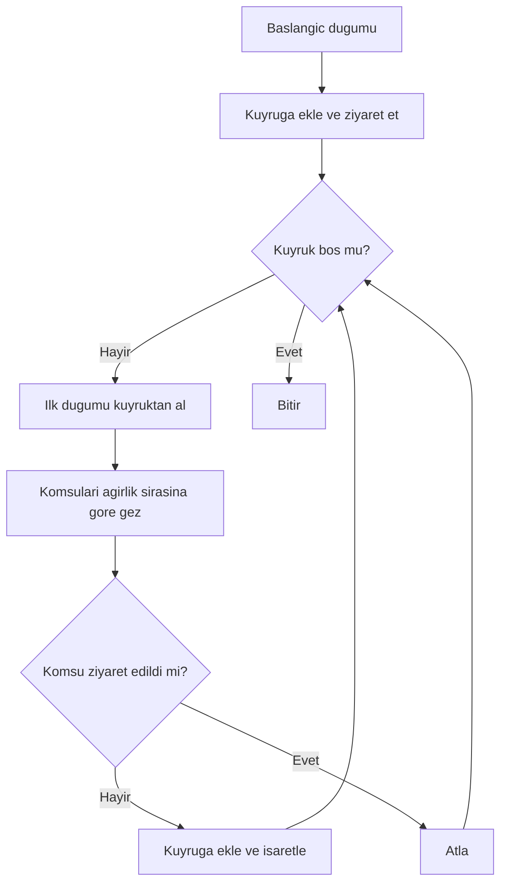

**Karmasiklik Analizi:**
- Zaman: O(V + E)
- Bellek: O(V)

**Literatur Incelemesi:** [1], [7]

**Proje Uygulama Notu:** `Graph.neighbors_sorted_by_weight()` kullanilarak komsular agirlik bazli siralanir; bu nedenle BFS sirasi klasik BFS'den farkli olabilir.

### 3.3 DFS (Depth-First Search)
**Amac:** Baslangic dugumunden derinleserek tum erisilebilir dugumleri gezmek.

**Girdi / Cikti:**
- Girdi: baslangic dugumu (`start_id`)
- Cikti: ziyaret sirasi (order)

**Calisma Mantigi:**
DFS, yigin (stack) yapisi kullanarak bir dalda olabildigince derine iner. Projede komsular agirlik sirasina gore siralanir ve **ters** sirayla yigina eklenir; boylece agirligi yuksek komsu daha erken ziyaret edilir.

**Akis Diyagrami (Mermaid):**
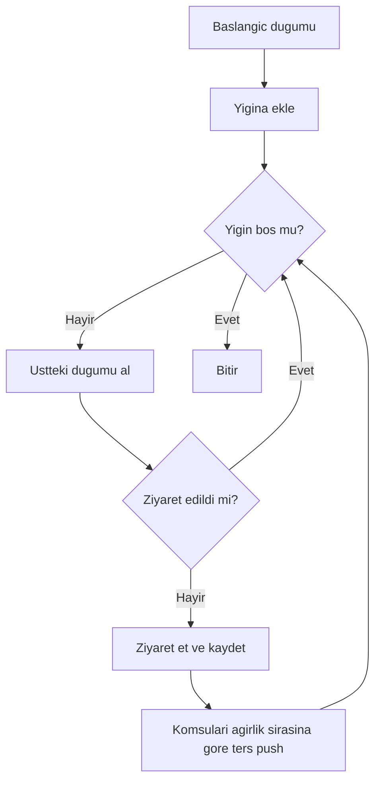

**Karmasiklik Analizi:**
- Zaman: O(V + E)
- Bellek: O(V)

**Literatur Incelemesi:** [1], [7]

**Proje Uygulama Notu:** DFS'nin deterministik cikti vermesi icin komsu siralamasi agirlik + alfabetik kurala baglanmistir.

### 3.4 Dijkstra Algoritmasi
**Amac:** Iki dugum arasindaki en kisa yolu bulmak.

**Girdi / Cikti:**
- Girdi: baslangic (`start_id`) ve hedef (`end_id`) dugumleri
- Cikti: ziyaret sirasi, en kisa yol, toplam maliyet

**Calisma Mantigi:**
Dijkstra, oncelikli kuyruk (min-heap) kullanarak en dusuk maliyetli dugumu secip komsularin maliyetlerini gunceller. Bu projede kenar maliyeti `cost = 1 - weight` olarak tanimlanmistir; yani agirlik arttikca maliyet azalir.

**Akis Diyagrami (Mermaid):**
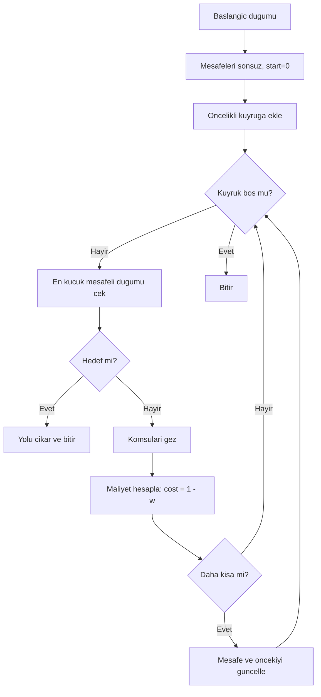

**Karmasiklik Analizi:**
- Zaman: O((V + E) log V)
- Bellek: O(V)

**Literatur Incelemesi:** [1], [3]

**Proje Uygulama Notu:** Kenar agirliklari 0-1 araligina kirpilarak maliyet hesaplanir; negatif maliyet yoktur.

### 3.5 A* (A-Star) Algoritmasi
**Amac:** Heuristik kullanarak en kisa yolu daha hizli bulmak.

**Girdi / Cikti:**
- Girdi: baslangic ve hedef dugumleri
- Cikti: ziyaret sirasi, en kisa yol, toplam maliyet

**Calisma Mantigi:**
A*, Dijkstra'ya benzer fakat `f(n) = g(n) + h(n)` fonksiyonunu kullanir. `g(n)` gercek maliyet, `h(n)` ise hedefe olan tahmini maliyettir. Projede `h(n)` su an **0** olarak ayarlanmistir; bu nedenle A* pratikte Dijkstra ile ayni sonucu verir.

**Akis Diyagrami (Mermaid):**
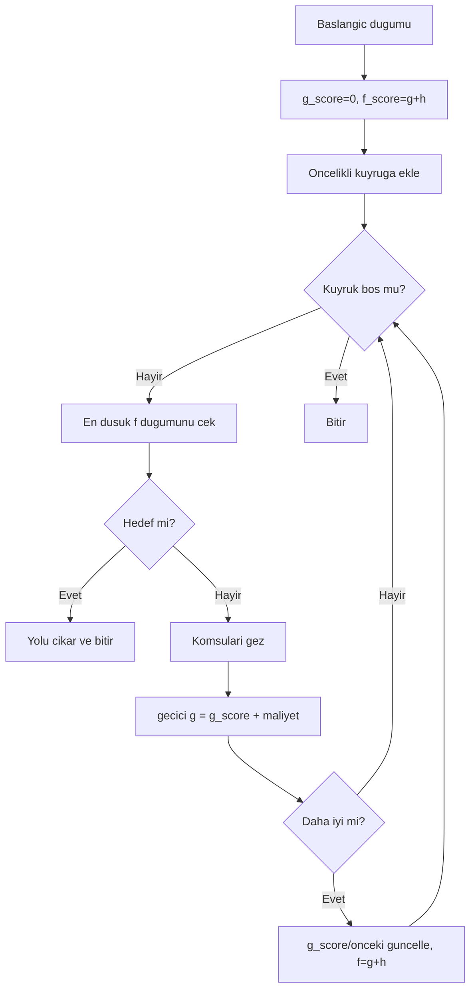

**Karmasiklik Analizi:**
- Zaman: O((V + E) log V) (heuristik kalitesine bagli olarak pratikte daha iyi olabilir)
- Bellek: O(V)

**Literatur Incelemesi:** [1], [4]

**Proje Uygulama Notu:** Heuristik su an 0 oldugu icin A* sonucu Dijkstra ile aynidir; ileride nitelik tabanli heuristik eklenebilir.

### 3.6 Bagli Bilesenler (Connected Components)
**Amac:** Grafi birbiriyle bagli alt topluluklara ayirmak.

**Girdi / Cikti:**
- Girdi: tum graf
- Cikti: bilesenler listesi (her bilesen bir dugum listesi)

**Calisma Mantigi:**
Tum dugumler uzerinde dolaşilir; ziyaret edilmemis bir dugum bulunduğunda BFS/DFS ile o bilesen bulunur ve listeye eklenir.

**Akis Diyagrami (Mermaid):**
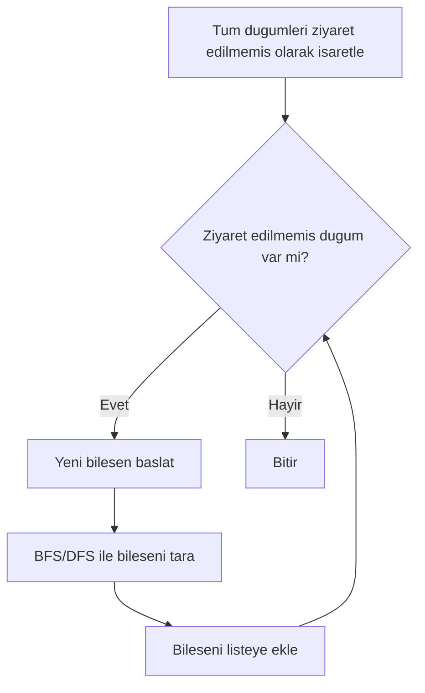

**Karmasiklik Analizi:**
- Zaman: O(V + E)
- Bellek: O(V)

**Literatur Incelemesi:** [1], [7]

**Proje Uygulama Notu:** Backend'de `components.py` dosyasi su an placeholder durumundadir; tasarimda hedeflenen mantik bu sekildedir.

### 3.7 Degree Centrality (Derece Merkeziligi)
**Amac:** En etkili (en fazla baglantisi olan) dugumleri belirlemek.

**Girdi / Cikti:**
- Girdi: tum graf
- Cikti: derece listesi ve ilk 5 dugum

**Calisma Mantigi:**
Her dugum icin derece (komsu sayisi) hesaplanir, azalan siralanir ve ilk 5 dugum tablo olarak sunulur.

**Akis Diyagrami (Mermaid):**
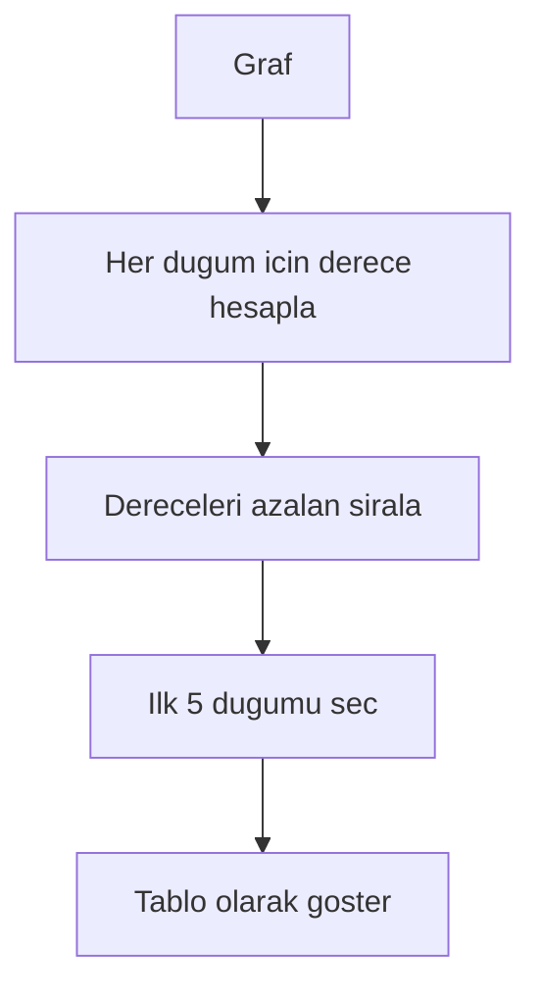

**Karmasiklik Analizi:**
- Zaman: O(V + E)
- Bellek: O(V)

**Literatur Incelemesi:** [6]

**Proje Uygulama Notu:** `degree_centrality.py` su an placeholder durumundadir; raporda hedeflenen isleyis belgelenmistir.

### 3.8 Welsh-Powell Graf Renklendirme
**Amac:** Komşu dugumlerin farkli renklere boyandigi bir renklendirme yapmak.

**Girdi / Cikti:**
- Girdi: tum graf
- Cikti: dugum-renk eslemeleri ve renk sayisi

**Calisma Mantigi:**
Dugumler dereceye (ve agirlikli dereceye) gore siralanir. Sirayla ilerlenir ve komsularla cakismayan ilk renk atanir.

**Akis Diyagrami (Mermaid):**
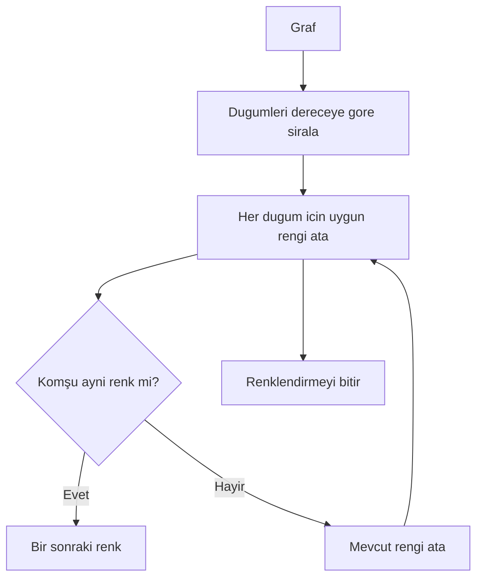

**Karmasiklik Analizi:**
- Zaman: O(V^2) (basit siralama ve kontrol)
- Bellek: O(V)

**Literatur Incelemesi:** [5]

**Proje Uygulama Notu:** `WelshPowellColoring`, agirlikli derece + derece + id siralamasini kullanir; bu sayede deterministik renk atamasi saglanir.

## 4. Sinif Yapisi ve Moduller

### 4.1 Genel Mimari (Mermaid)
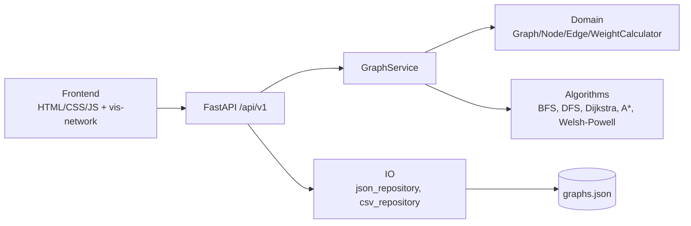

### 4.2 Sinif Diyagrami (Mermaid)
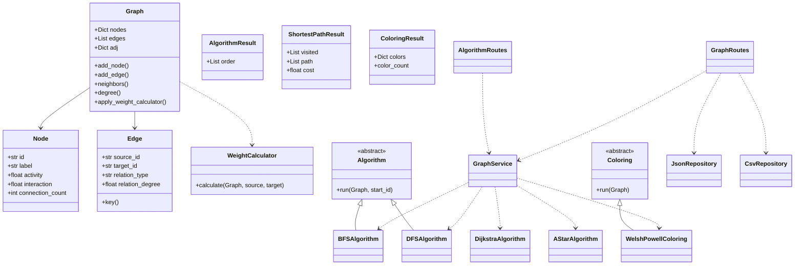

### 4.3 Modul ve Bilesen Aciklamalari
**Backend (FastAPI):**
- `backend/app/main.py`: API uygulamasini baslatir, CORS ayarlarini yapar.
- `backend/app/api/v1/algorithm_routes.py`: BFS/DFS/Dijkstra/A*/Welsh-Powell endpointlerini sunar.
- `backend/app/api/v1/graph_routes.py`: grafik kaydetme, listeleme, silme ve CSV export islemleri.
- `backend/app/services/graph_service.py`: grafi olusturur, agirliklari hesaplar ve algoritmalari calistirir.
- `backend/app/domain/*`: `Graph`, `Node`, `Edge`, `WeightCalculator` gibi cekirdek veri modeli.
- `backend/app/algorithms/*`: BFS/DFS, Dijkstra, A*, Welsh-Powell uygulanmistir; `components.py` ve `degree_centrality.py` placeholder.
- `backend/app/io/*`: JSON kalici depolama ve CSV export.
- `backend/tests/*`: algoritma ve agirlik hesaplama testleri.

**Frontend:**
- `frontend/public/index.html`: arayuz iskeleti; panel ve form yerlesimleri.
- `frontend/public/styles.css`: gorsel stil ve layout.
- `frontend/src/main.js`: istemci tarafli Graph modeli, UI olaylari, simulasyon, dosya yukleme/merge, API cagrilari.
- `frontend/src/graph/visNetworkGraph.js`: vis-network entegrasyonu ve graf gorsellestirme.
- `frontend/src/api/client.js`: REST API istemcisi.

### 4.4 API Endpoint Ozeti
| Endpoint | Yontem | Aciklama |
| --- | --- | --- |
| `/api/v1/algorithms/bfs` | POST | BFS calistirir |
| `/api/v1/algorithms/dfs` | POST | DFS calistirir |
| `/api/v1/algorithms/dijkstra` | POST | Dijkstra calistirir |
| `/api/v1/algorithms/astar` | POST | A* calistirir |
| `/api/v1/algorithms/coloring/welsh-powell` | POST | Welsh-Powell renklendirme |
| `/api/v1/graphs` | GET/POST | Kayit listeleme / kaydetme |
| `/api/v1/graphs/{id}` | GET/DELETE | Kayit getirme / silme |
| `/api/v1/graphs/{id}/export` | GET | Kenar tablosunu CSV olarak disari aktar |
| `/api/v1/graphs/{id}/export-nodes` | GET | Dugum tablosunu CSV olarak disari aktar |

## 5. Uygulama Aciklamalari, Ekran Goruntuleri, Test Senaryolari ve Sonuclar

### 5.1 Uygulama Ozeti
- Dugum/kenar ekleme, silme ve guncelleme islemleri arayuz uzerinden yapilir.
- BFS/DFS adim adim simulasyon ile gosterilir; ziyaret sirasi panelde listelenir.
- Dijkstra ve A* icin ziyaret sirasi, en kisa yol ve maliyet bilgisi sunulur.
- Welsh-Powell renklendirme sonucu dugumlere renk atar ve legend olusturur.
- CSV (kenar tablosu veya dugum tablosu) yukleme, iki dosyayi merge etme ve kaydetme desteklenir.
- Kayitli graflar listelenebilir, silinebilir ve CSV olarak disari aktarilabilir.

### 5.2 Ekran Goruntuleri (Yer Tutucular)
> Not: Asagidaki gorseller yer tutucudur. Ilgili ekran goruntulerini alip belirtilen dosya adlariyla ekleyiniz.

1) **Ana ekran ve graf gorunumu**

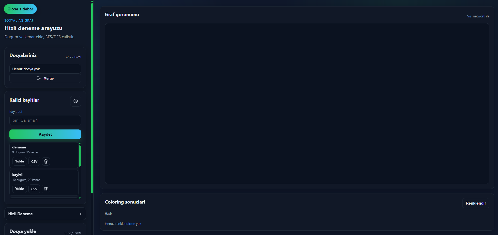

2) **Dugum ekleme ve kenar ekleme formlari**

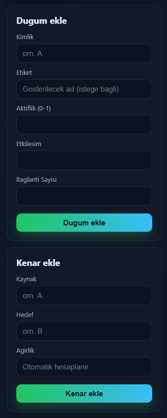

3) **BFS/DFS simulasyon paneli**

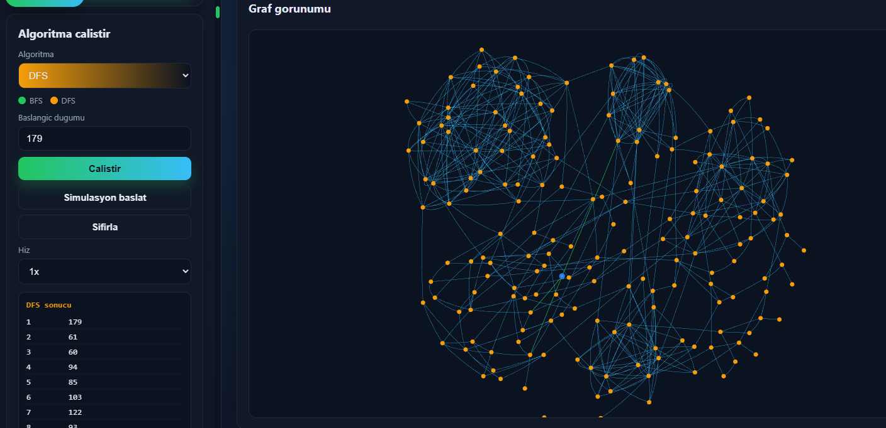

4) **Dijkstra/A* kisa yol sonucu ve yol vurgusu**

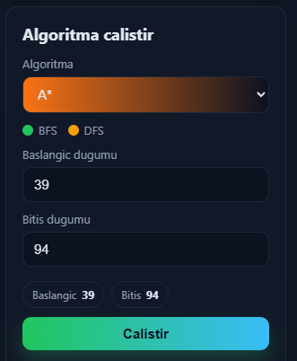

### A star sonucu:
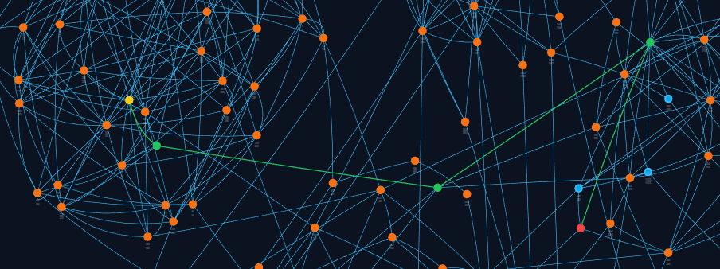

### Dijkstra sonucu:
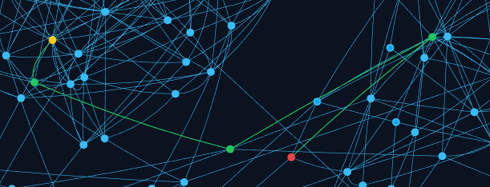

5) **Welsh-Powell renklendirme paneli**

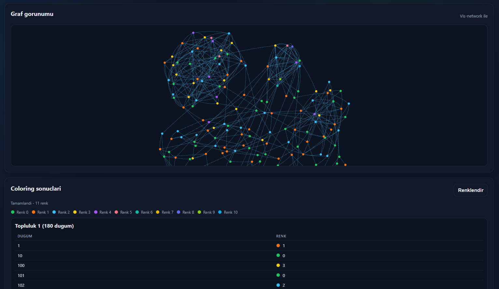

6) **CSV yukleme, merge ve kayitlar**

### 5.3 Test Senaryolari
| ID | Senaryo | Girdi/Adim | Beklenen Cikti | Sonuc |
| --- | --- | --- | --- | --- |
| TS-01 | Dugum ekleme | Aktivite=0.8, Etkilesim=12, Baglanti=3 | Dugum listeye eklenir, graf gorunur | (Eklenecek) |
| TS-02 | Kenar ekleme | A-B kenari | Kenar listede gorunur, agirlik hesaplanir | (Eklenecek) |
| TS-03 | BFS calistirma | Baslangic=A | Ziyaret sirasi panelde listelenir | (Eklenecek) |
| TS-04 | DFS calistirma | Baslangic=A | Ziyaret sirasi panelde listelenir | (Eklenecek) |
| TS-05 | Dijkstra kisa yol | Baslangic=A, Bitis=D | Yol ve maliyet gosterilir | (Eklenecek) |
| TS-06 | A* kisa yol | Baslangic=A, Bitis=D | Dijkstra ile ayni/benzer yol | (Eklenecek) |
| TS-07 | Renklendirme | Welsh-Powell | Dugumler farkli renge boyanir | (Eklenecek) |
| TS-08 | CSV import | `deneme.csv` | Dugum/kenarlar yuklenir | (Eklenecek) |
| TS-09 | Kaydet/Yukle | Graf kaydi alip geri yukle | Kayit listede gorunur | (Eklenecek) |
| TS-10 | Export | Kayitli grafi CSV disari aktar | CSV indirme linki calisir | (Eklenecek) |

### 5.4 Otomatik Testler
Backend'de `pytest` ile yazilmis testler bulunmaktadir:
- `backend/tests/test_algorithms.py`: BFS/DFS sirasinin agirliklara gore belirlendigini dogrular.
- `backend/tests/test_graph.py`: agirlik hesaplama dogrulamasi ve CSV formatinin komsulari dogru yazmasini kontrol eder.

### 5.5 Sonuclar ve Performans
Performans olcumleri kucuk (10-20 dugum) ve orta (50-100 dugum) grafiklerde hedeflenmistir. Asagidaki tablo, olcumler eklenecek sekilde hazirlanmistir:

| Grafik Buyuklugu | Algoritma | Calisma Suresi (ms) | Not |
| --- | --- | --- | --- |
| 10-20 dugum | BFS | (Eklenecek) | | 
| 10-20 dugum | DFS | (Eklenecek) | | 
| 10-20 dugum | Dijkstra | (Eklenecek) | | 
| 10-20 dugum | A* | (Eklenecek) | | 
| 10-20 dugum | Welsh-Powell | (Eklenecek) | | 
| 50-100 dugum | BFS | (Eklenecek) | | 
| 50-100 dugum | DFS | (Eklenecek) | | 
| 50-100 dugum | Dijkstra | (Eklenecek) | | 
| 50-100 dugum | A* | (Eklenecek) | | 
| 50-100 dugum | Welsh-Powell | (Eklenecek) | | 

## 6. Sonuc ve Tartisma

### 6.1 Basarilar
- Graf veri modeli, agirlik hesaplamasi ve temel algoritmalar (BFS/DFS, Dijkstra, A*, Welsh-Powell) calisir durumdadir.
- Frontend uzerinden interaktif graf olusturma, algoritma calistirma ve simulasyon desteklenmistir.
- CSV import/export ve kalici JSON kayit ozellikleri saglanmistir.
- Testler ile agirlik hesaplama ve BFS/DFS siralama davranisi dogrulanmistir.

### 6.2 Sinirliliklar
- Bagli bilesenler ve degree centrality algoritmalari backend'de placeholder durumundadir.
- A* heuristigi su an 0; hiz avantajini gosterecek bir tahmin fonksiyonu eklenmemistir.
- Veri kaliciligi dosya tabanli JSON dosyasina yazilmaktadir; es zamanli kullanim ve buyuk veriler icin yetersiz kalabilir.
- UI tarafinda performans olcumu ve metriklerin otomatik raporlanmasi bulunmamaktadir.

### 6.3 Olası Gelistirmeler
- Bagli bilesenler ve degree centrality algoritmalarinin tam uygulanmasi.
- A* heuristiginin kullanici niteliklerine dayali bir uzaklik fonksiyonuyla zenginlestirilmesi.
- Buyuk grafikler icin performans optimizasyonlari ve layout secenekleri.
- Veritabani entegrasyonu ile kalici ve guvenilir depolama.
- Algoritma sonuclarinin grafik uzerinde animasyonlu anlatimi ve rapor cikti otomasyonu.

## Kaynakca
[1] Cormen, T. H., Leiserson, C. E., Rivest, R. L., Stein, C. (2009). *Introduction to Algorithms* (3rd ed.). MIT Press.

[2] Sedgewick, R., Wayne, K. (2011). *Algorithms* (4th ed.). Addison-Wesley.

[3] Dijkstra, E. W. (1959). A note on two problems in connexion with graphs. *Numerische Mathematik*.

[4] Hart, P. E., Nilsson, N. J., Raphael, B. (1968). A formal basis for the heuristic determination of minimum cost paths. *IEEE Transactions on Systems Science and Cybernetics*.

[5] Welsh, D. J. A., Powell, M. B. (1967). An upper bound for the chromatic number of a graph and its application to timetabling problems. *The Computer Journal*.

[6] Freeman, L. C. (1979). Centrality in social networks: Conceptual clarification. *Social Networks*.

[7] West, D. B. (2001). *Introduction to Graph Theory* (2nd ed.). Prentice Hall.
